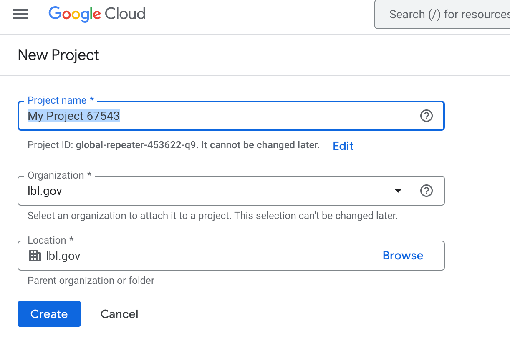
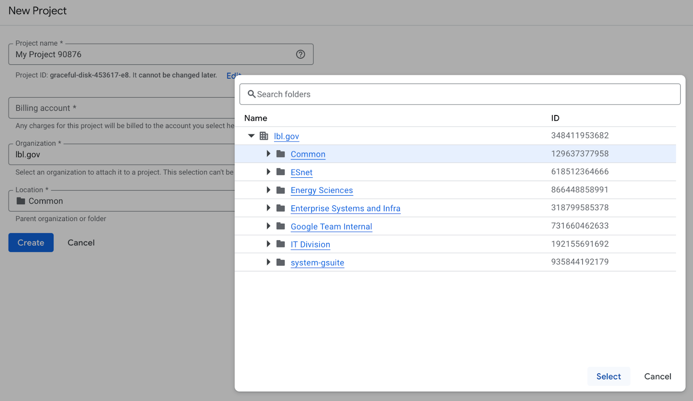
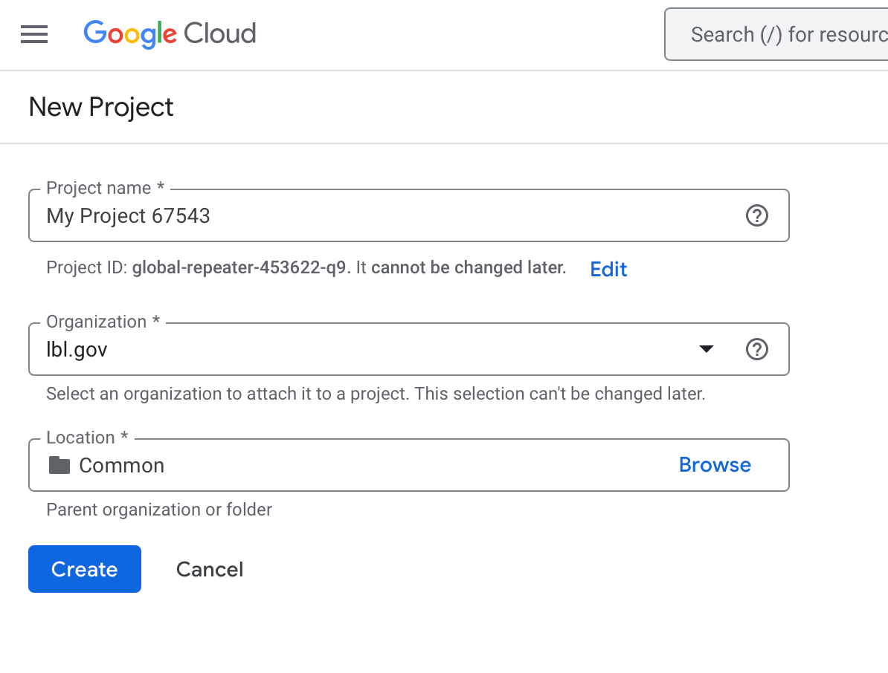

# Creating a Google Cloud Project

This document outlines the steps for users to create a LBNL Google Cloud users to create a new Google Cloud project, ensuring proper billing, organization, and location settings.

## Prerequisites

* You must use your LBNL email identity to create a Google Cloud project within the `lbl.gov` organization.
* While any LBNL user can create a Google Cloud, you must have access to the "LBNL" Billing Account in order to create and run resources and services within the account.
* If you create a Google Cloud project **without** selecting a Billing Account, you won't be able to create any resources in your project and instead you'll be prompted to attach your project to a Billing Account. 
* Access to the "LBNL" Billing Account is provided to users upon request and after a short discussion with the LBNL Cloud Team about the parameters and rules of using Google Cloud.

## Step-by-Step Instructions

1.  **Navigate to the Google Cloud Console:**
    * Ensure you are logged into Google with your LBNL account.
    * Open your web browser and go to the Google Cloud Console: [console.cloud.google.com](https://console.cloud.google.com).

2.  **Create a New Project:**
    * Click on the project selector dropdown at the upper left area on the top of the page (it usually displays "Select a project" or has the name of another existing project displayed).
    * Click the "New Project" button.

3.  **Project Details:**
    * **Project Name:** Enter a descriptive name for your project. Choose a name that clearly identifies the purpose of the project.
    * **Billing Account:**
        * Click anywhere in the Billing Account box to open up the drop down list.
        * Select the "LBNL" billing account. This ensures your project's costs are billed directly to LBNL for recharge against your Project ID.
    * **Organization:**
        * Ensure the "lbl.gov" organization is displayed in the list.  As long as you're logged in with your LBNL account this will be filled in for you automatically.  This ensures your project is associated with LBNL's Google Cloud organization.
    * **Location:**
        * Click the "Browse" button.
        * Navigate down one level from the root "lbl.gov" organization, and select the folder named "Common". This is where most standard LBNL projects should be created.

4.  **Create the Project:**
    * Review the project details to ensure they are correct.
    * Click the "Create" button.

5.  **Project Creation and Selection:**
    * Google Cloud will begin creating your project. This process may take a few moments.
    * Once the project is created, you will be automatically redirected to the project's dashboard. If not, you can select your newly created project from the project selector dropdown.

## Screenshots

* **Initial View:**

* **"Browse" Location and select "Common" folder:**

* **Completed with the location set to "Common"**

## Important Notes

* **Project Naming Conventions:** Use a meaningful name to clearly indicate the purpose of the project to maintain consistency.
* **Billing Account:** Using the correct "LBNL" billing account is crucial for proper cost tracking and management.
* **Organization and Location:** Selecting the "lbl.gov" organization and the "Common" folder ensures your project adheres to LBNL's organizational structure and resource management policies.
* **Permissions:** If you encounter issues creating a project, contact [ScienceIT@lbl.gov](mail:scienceit@lblgov) to verify your permissions and access.
