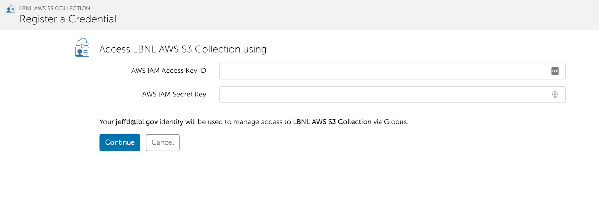
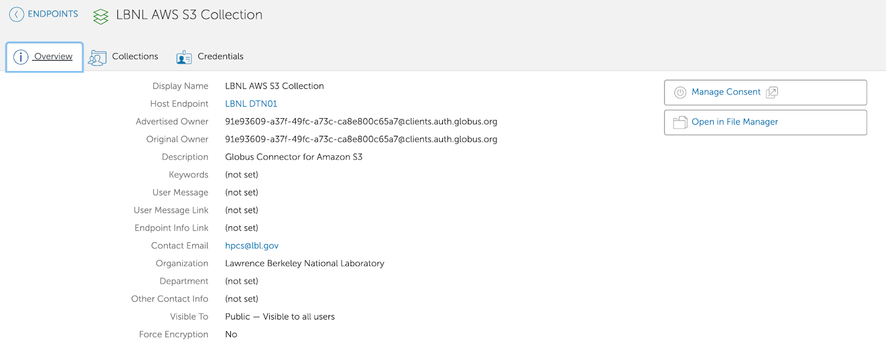
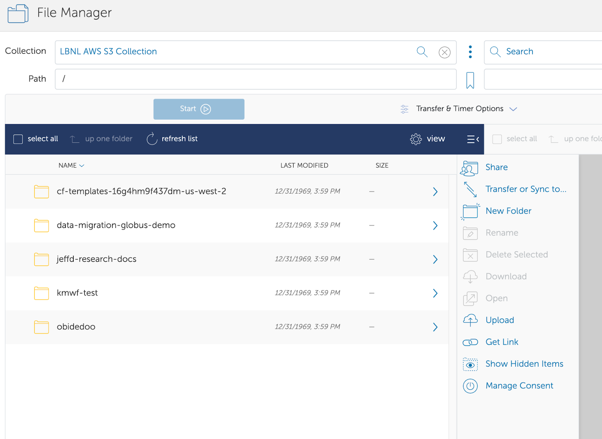

# Using the Globus AWS S3 Connector

In order to setup Globus to access a S3 bucket, you'll need to have an IAM access key ID and a secret key ready to go. Due to Globus's implementation of the connector you can only add a single IAM access key ID and secret key to your Globus configuration, however you'll have access to any buckets that IAM access key ID is configured to have access to.

Please note that for your first time setting up the S3 connector you’ll have to go through various “consent” and “authorization” prompts, and those steps are not documented here.  Giving consent is a standard part of the Globus process whereby you authorize Globus to perform additional privileged operations with the selected endpoint.  If you’ve already given permissions to Globus for the S3 connector, you might not see the consent steps.

!!! note

    This guide assumes you’ve already setup a S3 bucket and configured the IAM access permissions to that bucket. If you need help doing that, see the [AWS S3 documentation](https://docs.aws.amazon.com/AmazonS3/latest/userguide/example-walkthroughs-managing-access-example1.html){:target="_blank"} {{ ext }} for more information.

## Select Globus S3 Endpoint

* Login with Globus at [https://globus.lbl.gov](https://globus.lbl.gov/).
* Select "Endpoints" from the left navigation.
* Enter "LBNL AWS S3 Collection" into the search textbox.
* From the list of endpoints that appear, click on the "LBNL AWS S3 Collection" link.

## Setup Credentials

* Click on the "Credentials" tab of the "LBNL AWS S3 Collection" endpoint page.
* Here is where you register your AWS IAM access key ID and secret key with Globus.

* After you've entered them, click the "Continue" button, and you'll be taken back to the full "Credentials" tab where you can see your saved AWS access credentials.

* At this point you are set up to access the S3 buckets with Globus. Click the "Overview" tab, and then the "Open in File Manager" button to see the S3 buckets and the data that are available using your AWS credentials.

## Create Guest Collection from LBNL AWS S3 Collection

* Click on the "Collections" tab of the "LBNL AWS S3 Collection" endpoint, and then click on the "Add a Guest Collection".

* Enter in the path to the top level folder you want visible in your collection in the “Directory” field (or enter “/” to use all buckets available to those credentials in your collection).  You can also click the “Browse” button to get a directory view and select the bucket or subfolder folder you want.

* Enter a value for the “Display Name” field, and then click the “Create Collection” button.

