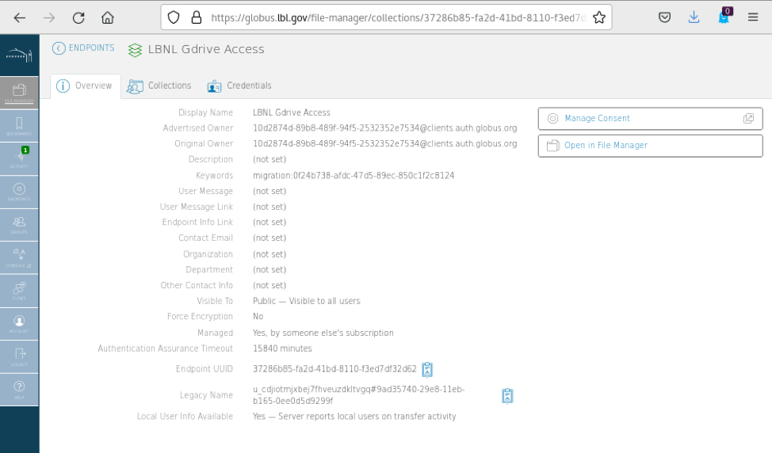

# Globus for Google Drive

* Search for [LBNL Gdrive Access](https://globus.lbl.gov/file-manager/collections/37286b85-fa2d-41bd-8110-f3ed7df32d62/) (or use the link just above) and click on the endpoint.

## Creating a Guest Collection in Gdrive

* Click on the "Collections" tab and authenticate if prompted by hitting the "Continue" button. Consent to allow Globus to manage the collection
* Click Add a Guest Collection

* Enter the drive path you want to view and select a display name for the collection, then click Create Collection.

* Return to the Endpoint tab and search for your new collection by the Display Name you gave it.

* Open the new collection in the File Manager, and you are ready to transfer files to or from your LBNL Gdrive Collection!

## Creating a Shared Collection in Gdrive

* Find the "LBNL Gdrive Access" Endpoint in the Globus UI
* Click on the Collections Tab and click "Add a Guest Collection"
* Browse to the folder in your Google Drive that you wish to share and give it a Display Name. Click Create Collection.

* Select Add Permissions - Share With (Here the "/" is the root of the folder you browsed to when creating this share. In this example, it is "My Drive/Fernsler's Demo Share/" in user fernsler's LBNL Google Drive)
* Enter the name/email of a collaborator you wish to share with, and give them appropriate permissions. By default, read only access to shares is active. Click Add Permission to create the share.  Globus will send the user you are sharing the folder with an email and they will be able to find the Collection you shared by its Display Name in the endpoint tab search (in this example, it is “Share with Wei”)  

