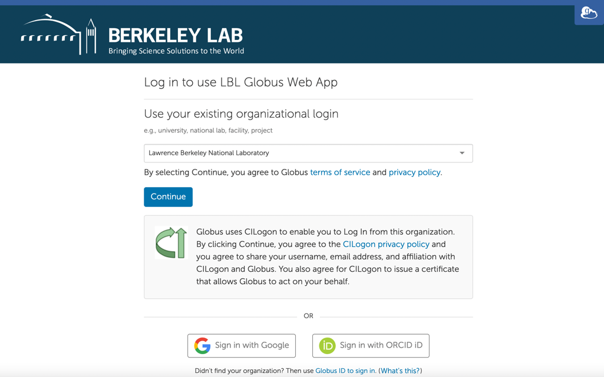

# Globus for Lawrencium

## Login:

* Open a browser and navigate to [https://globus.lbl.gov](https://globus.lbl.gov){:target="_blank"} {{ ext }}.
* You may choose your institution from the drop-down list. If your institution is not listed, you may Sign in using Google or ORCID id. Ideally, the email associated with your Lawrencium user account shall be used to Sing in to Globus.

    

* If you choose LBNL as your organization, you will be directed to enter your LBNL credentials. Enter your username and password.

    

* Enter OTP

    

## Search Endpoint:

* Once authenticated, enter the endpoint name in the collection search bar

    

* For example, search for `lbnl#lrc` to find lawrencium's GridFTP endpoint

    

* Scroll down to find the `lbnl#lrc` endpoint owned by kmfensler@lbl.gov.

    

* When the endpoint is selected, it will appear as a collection in a file manager. By default, the Globus UI will display your `$HOME` directory. Type a file path name in the navigation bar next to **Path** to navigate to a different directory (i.e. `/global/scratch/<username>`)

    

* Click on the three dots next to the collection to view its properties.