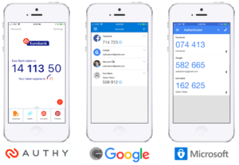
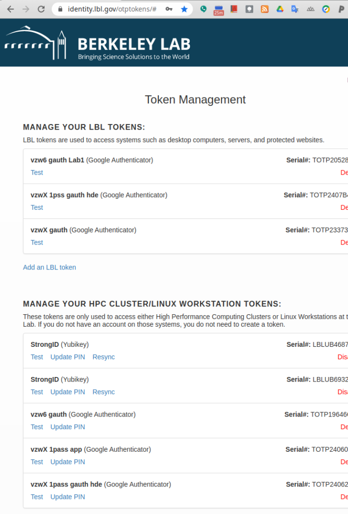
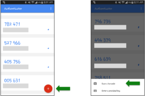

# Multi-Factor Authentication (MFA)

!!! note "Link to Token Management Page"
    Visit the [Token Management web page](https://identity.lbl.gov/otptokens/login) to manage your MFA; detailed instructions are given below.

## Introduction

All users are required to use Multi-Factor Authentication (MFA) for logging into IT HPC resources such as the Lawrencium cluster and other scientific computing clusters managed by HPCS. MFA provides greater protection than regular passwords against phishing and other modern threats to your digital security. With MFA, you authenticate using your password plus a "one-time password" (OTP). As the name implies, you can use an OTP only once.

All users are required to install and use an Authenticator app in their smart phones and configure it to generate OTPs.  There are many such apps, some of the popular ones and known to work are Google Authenticator (GA), Microsoft Authenticator, and Authy.  (Note, Duo is supposed to work, but at least two users have run into time sync problem between the Duo implementation and the LBL Radius server, thus at this time, Duo is NOT recommended).

There are also desktop apps, but they somewhat negate the advantage of MFA being "something you have with you". But if you need a dekstop app, you can try to use the Authy desktop app by using the instructions in [this link](https://docs-research-it.berkeley.edu/services/high-performance-computing/user-guide/using-authy/).

!!! note "YubiKey"
    Lastly, it is also possible to use a [YubiKey](https://www.yubico.com/products/yubikey-5-overview/) as your MFA.  This has a significant setup cost and in person verification; if you are interested in this,  please email HPCS support at hpcshelp@lbl.gov for additional assistance.

## MFA Instructions

### **Step 1**: Download and install Google Authenticator on a mobile device.

* In the Google Play store or iOS App Store on your smartphone or tablet, search for and install Google Authenticator (GA), Microsoft Authenticator, Authy and Duo.

### **Step 2**: Visit and Login to [OTP Token Management Interface](https://identity.lbl.gov/otptokens/login)

* Berkeley Lab users can access the interface by clicking ‘Berkeley Lab Login’ in the top section.

* External Users (Non Berkeley Lab users) should have linked one of their personal accounts (Facebook or Google or UC Berkeley) with the LRC HPC Cluster account and using that linked personal account credentials can access the token management interface.

* External users must link their account to the email address you used while requesting an account. You would request an email to link an account. If you haven’t received an email or the link is expired, then you can request a linking email using the MyLRC portal. To do so, please go to your profile on the upper right-hand side. On your profile page at the bottom, you will see a button Request Linking Email. Please click on it, and you will get an email within half an hour. If you don’t get the email, please get in touch with us at hpcshelp.lbl.gov.

### **Step 3**: After login create a HPC Cluster/Linux Workstation Token

* All HPCS managed Clusters and Linux workstations use the HPC Cluster/Linux Workstation token shown in the second section of the ‘Token Management’ page (toward the bottom).

{ width=440 }

* Click on the ‘Add Token’ link and follow instructions. 

!!! warning "Important" 
    Remember the PIN that you are setting which you will use every time you access the resource. PINs can be changed or updated later from this interface itself.

* After you've successfully created your new token, a QR code for that token will then be displayed.

### **Step 4** Scan the 2-D QR code

* Back on your smartphone or tablet, from the menu of the Google Authenticator app, select ‘Add an account” and then “Scan a barcode”. This will store the token in GA app and its now ready to generate One Time Passwords.

!!! note "Note"

    If your device does not already have a QR code reader app installed, the Google Authenticator app may first lead you through the process of installing one.

!!! note "Important"

    When you access the resource remember to type the token PIN first followed the OTP from the GA app at the password prompt.

    For instance, if your PIN was 9999 (hint: don’t use this example as your own PIN!), and the one time-password currently displayed by Google Authenticator was 123456, you’d enter the following at the Password prompt:
    Password: 9999123456

## Troubleshooting

If you’ve already set up your token but are unable to log into the cluster successfully – here’s what to try:

!!! tip "Tip 1"

    Make sure you’re including the PIN as part of your password

    At the Password: prompt, make sure that you’re entering your token PIN, followed immediately by the 6-digit one-time password from Google Authenticator.

!!! tip "Tip 2"

    Wait to enter the one-time password until a new one has just been displayed

    If the ‘countdown clock’ indicator in the Google Authenticator app is nearing its end, signifying that the existing password is about to expire, try waiting until a new one-time password has been displayed. Then enter that new password, immediately after your PIN, at the Password: prompt.

!!! tip "Tip 3" 

    Check that, in your SSH command or in the configuration for your SSH application, you’re using your correct login name (i.e., your Linux user name) on the cluster

!!! tip "Tip 4" 
    
    Check that, in your SSH command or in the configuration for your SSH application, you’re using the correct hostname for the cluster’s front-end/login nodes, lrc-login.lbl.gov, or for its Data Transfer Node, lrc-xfer.lbl.gov

!!! tip "Tip 5" 
  
    Test – and if needed, reset – your token or its PIN

    Visit the [Token Management web page](https://identity.lbl.gov/otptokens/) to log in to this Token Management page.

    A list of one or more tokens should then be displayed. From this list, find your relevant token: the one that you entered into Google Authenticator on the smartphone or tablet you’re currently using. (If you want to check this further, the “TOTP number” that appears in the box for your token, on the Token Management web page, should match the TOTP number in Google Authenticator’s window on your device.)

    If there’s only a “Reset” option in that token’s box, click that link. Then proceed to the next step, below.

    If there’s a “Test” option, click that link, then enter your PIN followed immediately by your Google Authenticator 6-digit one-time password, and click the “Test Now” button.
    
    If your test(s) fail, click “Done”. Then click the “Reset PIN” link and reset your PIN. (You can even ‘reset’ it to your current PIN.)

    Try the “Test” option once again.

    Once you get a successful test of your PIN plus one-time password on this web page, you can try logging into cluster once again and see if you’re successful there, as well.

!!! tip "Tip 6" 
    
    Try creating a brand new token and add the new token to Google Authenticator, as described in the instructions above. (Before or after doing this, you can delete your existing token – both on the LBL Token Management web page and in the Google Authenticator app on your device – to avoid any confusion with the new token.)

!!! tip "Tip 7" 

    If none of the above tips give you a clue on what is not working, try to SSH to LRC resources from a different IP address i.e from a different computer or laptop. If that works email the IP address from where its not working to LRC support@hpcshelp@lbl.gov .