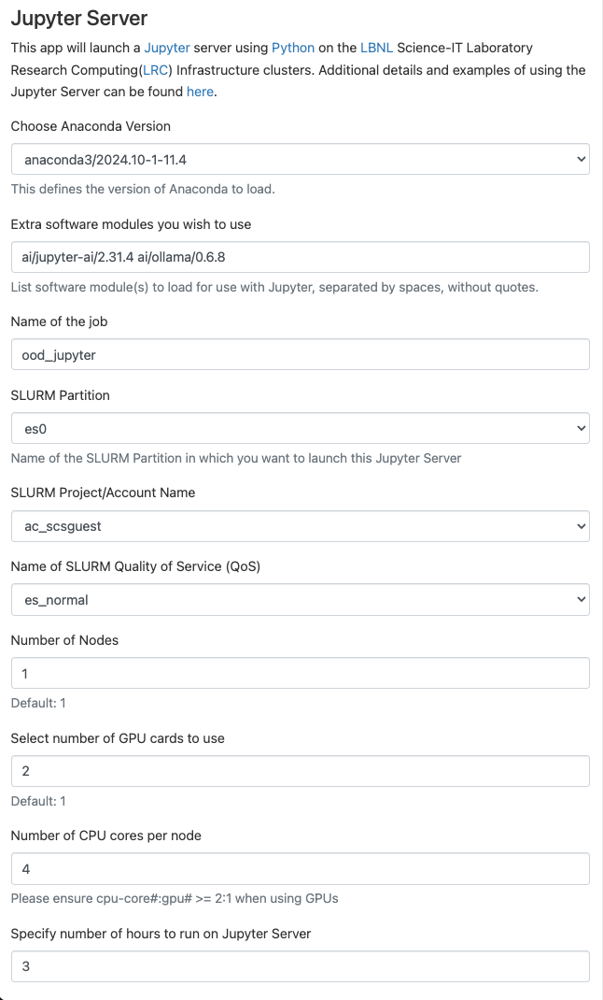
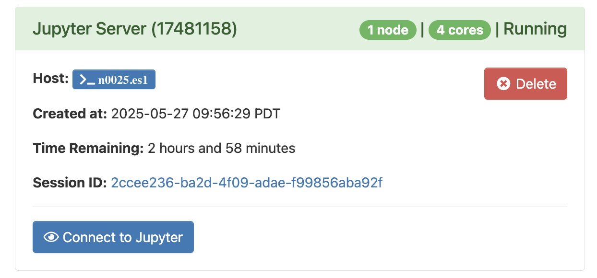
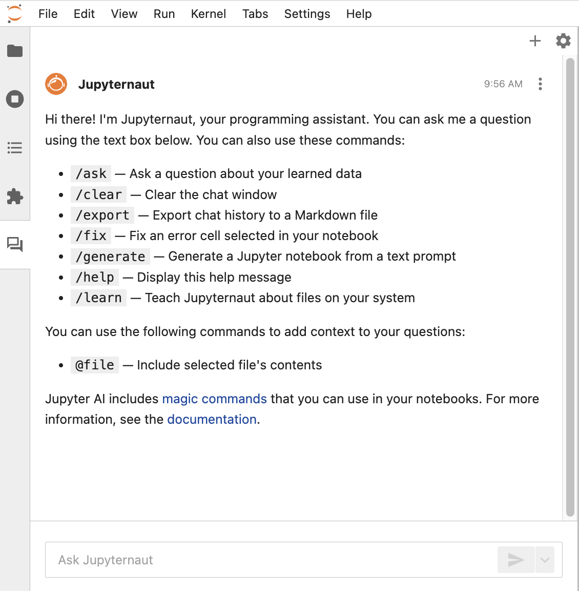

# Using Jupyter AI with Ollama

To use [Jupyter AI](https://jupyter-ai.readthedocs.io/){:target="_blank"} {{ ext }} on LRC Open Ondemand, follow the following steps. In the example, we will use `es0` partition as an example, but you are free to use other partitions that are available to you. However, note that Large Language Models (LLMs) work faster and more efficiently on GPU nodes.

1. Choose the **Jupyter Server** option from the list of apps. Select the following parameters in the form presented:
    * Choose `anaconda3/2024.10-1-11.4` option for the anaconda version.
    * Type in (or copy) the following additional modules in the **Extra software modules you wish to use** textbox (two modules are separated by a space):
    ```
    ai/jupyter-ai/2.31.4 ai/ollama/0.6.8
    ```
    * (Optional) Type in a **Name of the job**.
    * Choose a **SLURM Partition** from the list. `es0` or `es1` is recommended. If you choose `es1` then you will have to choose a **GPU Type from a dropdown**.
    * Choose **SLURM Project/Account Name** and **QoS** according to the availability on the dropdowns and your needs. For **Qos**, you can choose `lr_normal` or `es_normal` if you are unsure.
    * Select number of GPU cards to use. The number of GPU cards to use can range from 1 to the maximum number specified in the **GPU Type dropdown box**. Start with **1** to check if that is enough for your use.
    * Select the number of CPU cores per node.     If you are on `es0`, use 2 cores per GPU. If you are on `es1`, use the following CPU cores / GPU to guide your choice per node.
        * `V100`: 2 cores per GPU
        * `A40`: 16 cores per GPU
        * `H100`: 14 cores per GPU

    * Enter the hours to run on Jupyter Server (default value is 1 hour). 

    !!! note "Example form for choosing one GTX2080TI GPU card on es0 partition"
        

2. Click **Launch**. Upon clicking **Launch**, you may have to wait for the requested resource to be allocated.
3. When the server is ready, Click on the **Connect to Jupyter** button to open your jupyter server session.
    
4. After clicking on **Connect to Jupyter**, you will enter the JupyterLab interface. To start **Ollma**, follow the steps:
    * Open a new Terminal: File > New > Terminal
    * On the terminal type and enter the command `start-ollama.sh`
    * Once the script lists Ollama models, it means that Ollama is running on the node you have requested and available to you to use through the `jupyter-ai` extension
5. Click on the Jupyter AI chat interface on the left-side of the JupyterLab workspace. To change models or settings click on the settings icon of the Jupyter AI interface on the top right corner.
    