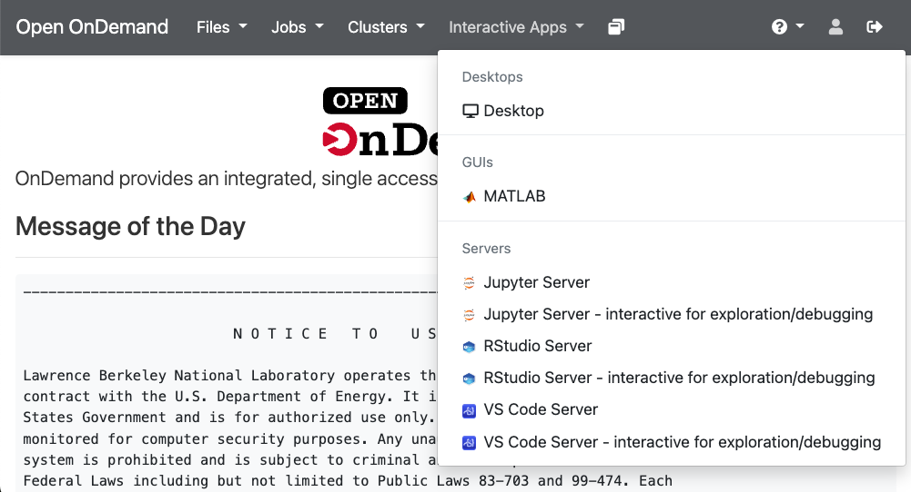

# Jupyter Server

The Jupyter Notebook is a web application that enables you to create and share documents that can contain a mix of live code, equations, visualizations, and explanatory text. This is an introduction to using Jupyter notebooks on Lawrencium.

Before getting started, make sure you have [access to the Lawrencium cluster](../accounts/project-accounts.md), as you will need your LRC username and one-time password to log in.

As described next, you can start a Jupyter notebook via the Open OnDemand service, which allows you to operate completely via your web browser on your local computer (e.g., your laptop).

## Jupyter notebooks on Open OnDemand

### Running a notebook

1. Connect to [https://lrc-ondemand.lbl.gov](https://lrc-ondemand.lbl.gov).

2. After logging in with your [LRC username]() and [one-time password(OTP)], you will get to the Open OnDemand welcome screen. Click the **Interactive Apps** pulldown.

3. Choose the Jupyter Server option from the list of apps.

4. Fill out the form presented to you and click on **Launch**. The option **Type of use** has two options:
    - *interactive_mode, for exploration*: choose this option for non-intensive computations (notebook runs on the OpenOnDemand server)
    
    - *compute_mode*: choose this for intensive computations on compute nodes (the form will present you with additional options for nodes, cores and qos)

    Note that you can click on the **Use JupyterLab instead of Jupyter Notebok?** checkbox if you prefer the [JupyterLab](https://jupyterlab.readthedocs.io/en/latest/) interface. See below for an example of launching a jupyter server on a GPU partition in compute_mode.

5. Once the server is ready, you will be able to click on the **Connect to Jupyter** button to get a jupyter notebook.

### Example: Launch a Jupyter Server on the ES1 GPU parition

1. Select the following parameters to lauch a jupyter server on one GPU card of a A40 GPU node using a normal priority queue (with 16 CPU cores):
    - Type of use: **compute_mode**
    - SLURM Partition: **es1**
    - Name of SLURM Quality of Service (QoS): **es_normal**
    - Number of nodes: **1**
    - GPU card cound and/or type: **A40:1**
    - Number of CPU cores per Node: **16** 
  
    Please also choose or enter the **SLURM Project/Account Name**, the **Wall Clock Time**, and **Name of the job** according to your needs.
    

2. Upon clicking **Lauch**, you may have to wait for the requested resource to be allocated. 

3. When the server is ready, click on the **Connect to Jupyter** button to open your jupyter server session. 
    

4. After clicking on **Connect to Jupyter**, your home directory will be displayed. From the **New** dropdown menu (next to **Upload** near the top right) select one of the Notebook or Other options:
    
    - Under New > Notebook, you will find several Jupyter kernels with different Python versions and packages that you can choose according to your requirements.
    - Under New > Other, you have options to create a new text file, folder or open a terminal session.

5. To move between your Notebook and the control page that allows you to see your files and select any running Notebooks or terminals, click on **Running** tab under the Jupyter banner in the upper left corner.
    

6. You can have your session continue to operate in the background by selecting the **Logout** button.

7. To terminate a running Notebook, select the **My Interactive Sessions** tab on the Open OnDemand menu and click on **Delete**.

Further information about working with Jupyter Notebooks can be found in the [Jupyter Documentation](https://docs.jupyter.org/en/latest/){:target="_blank"} {{ ext }}.
