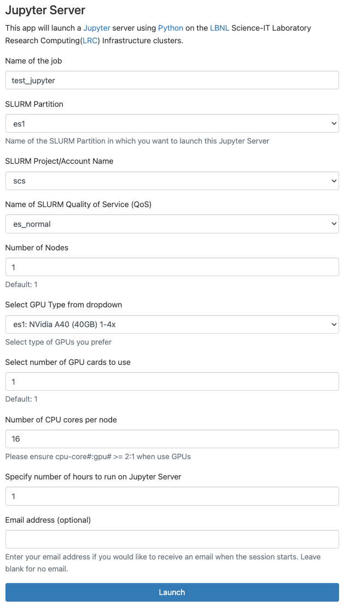

# Jupyter Server

The Jupyter Notebook is a web application that enables you to create and share documents that can contain a mix of live code, equations, visualizations, and explanatory text. This is an introduction to using Jupyter notebooks on Lawrencium.

Before getting started, make sure you have [access to the Lawrencium cluster](../accounts/project-accounts.md).

As described next, you can start a Jupyter notebook via the Open OnDemand service, which allows you to operate completely via your web browser on your local computer (e.g., your laptop).

See the [video recording](https://youtu.be/vFdpvpGUzFs) for the hands on experience.
<div class="video-container">
    <iframe src="https://www.youtube.com/embed/PF61XGpMsxE?si=woafDz4cX-wEiDtX" 
        title="YouTube video player" 
        frameborder="0" 
        allow="accelerometer; autoplay; clipboard-write; encrypted-media; gyroscope; picture-in-picture; web-share"  
        allowfullscreen>
    </iframe>
</div>


## Jupyter notebooks on Open OnDemand

!!! note "Navigating to scratch directory from Jupyter Lab interface"

    For easy access to your `scratch` directory from Jupyter on Open OnDemand, you can create a symlink to your `scratch` directory in your home directory as follows:

    ``` bash
    ln -s /global/scratch/users/$USER /global/home/users/$USER/scratch
    ```

### Running a notebook

1. Connect to [https://lrc-ondemand.lbl.gov](https://lrc-ondemand.lbl.gov){:target="_blank"} {{ ext }}.

2. After [logging in](overview.md), you will get to the Open OnDemand welcome screen. Click the **Interactive Apps** pulldown.

3. Choose the **Jupyter Server** option from the list of apps. Choose the **Jupyter Server - interactive for exploration/debugging** only if you are writing/debugging code and not doing any computationally intensive tasks.


4. Fill out the form presented to you and click on **Launch**. An example of filling this form is shown in the next section.

5. Once the server is ready, you will be able to click on the **Connect to Jupyter** button to get a jupyter notebook.

### Example: Launch a Jupyter Server on the ES1 GPU parition

1. Select the following parameters to lauch a jupyter server on one GPU card of a A40 GPU node using a normal priority queue (with 16 CPU cores):
    - SLURM Partition: **es1**
    - Name of SLURM Quality of Service (QoS): **es_normal**
    - Number of nodes: **1**
    - Select GPU Type from dropdown: **es1: NVidia A40 (40 GB) 1-4x**
    - Select number of GPU cards to use: **1**
    - Number of CPU cores per Node: **16** 
  
    Please also choose or enter the **SLURM Project/Account Name**, the **Wall Clock Time**, and **Name of the job** according to your needs.

    !!! note "Example form for choosing a A40 GPU card"
        

2. Upon clicking **Launch**, you may have to wait for the requested resource to be allocated. 

3. When the server is ready, click on the **Connect to Jupyter** button to open your jupyter server session. 
    

4. After clicking on **Connect to Jupyter**, you will enter the classic Jupyter or Jupyterlab environment. 
    - Under File > New > Notebook, you will find several Jupyter kernels with different Python versions and packages that you can choose according to your requirements. These include:
        * Python 3 (ipykernel) - python through `anaconda3/2024.02-1-11.4` module
        * torch 2.3.1 py3.11.7 - PyTorch 2.3.1 through `ml/pytorch/2.3.1-py3.11.7` module
        * tf 2.15.0 py3.10.0 - TensorFlow 2.15.0 through `ml/tensorflow/2.15.0-py3.10.0` module

5. You can have your session continue to operate in the background by selecting the **Logout** button (upper right hand corner) on Open OnDemand.

6. To terminate a running Notebook, select the **My Interactive Sessions** tab on the Open OnDemand menu and click on **Delete**.

Further information about working with Jupyter Notebooks can be found in the [Jupyter Documentation](https://docs.jupyter.org/en/latest/){:target="_blank"} {{ ext }} and [JupyerLab Documentation](https://jupyterlab.readthedocs.io/en/latest/){:target="_blank"} {{ ext }}
