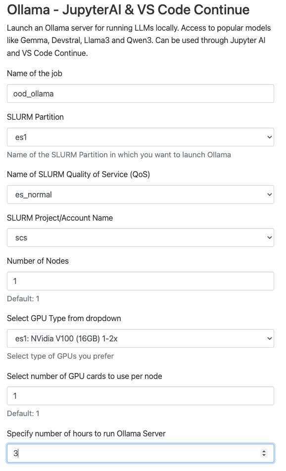
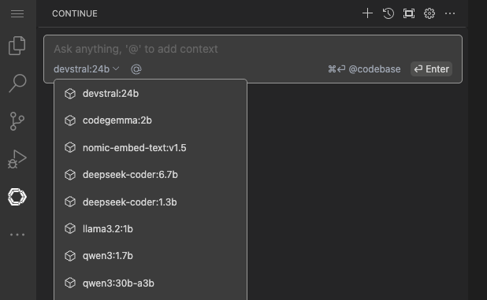

# Using Ollama with Jupyter and VS Code

The **Ollama - JupyterAI & VS Code Continue** app can be used on LRC Open Ondemand for running LLMs locally on Lawrencium compute resources. This can be useful for prototying applications that make use of LLMs, or for general experimentation.

To use the app, take the following steps:

1. After clicking on the app on the **Interactive Apps** menu of LRC Open Ondemand, fill out the form with your requirements. Below is an example that will request one V100 GPU for 3 hours. GPU nodes (`es0` or `es1` partition) are recommended for running LLM models. Choose the partition, GPU type and number of GPUs according to your needs. 

    ??? note "Example form for choosing one V100 GPU card on es1 partition"
        

2. Click **Launch**. Upon clicking **Launch**, you may have to wait for the requested resource to be allocated.
3. When the server is ready, you will get two buttons: **Connect to Jupyter** and **Connect to VS Code** as shown in the image below.
    

## Ollama on Jupyter
If you click on **Connect to Jupyter**, you will get a Jupyter Lab instance with [Jupyter AI](https://jupyter-ai.readthedocs.io/){:target="_blank"} {{ ext }} extension. To chat using the default Ollama model, click on the Jupyter AI chat interface on the left-side of the JupyterLab workspace. To change models or settings, click on the settings icon of the Jupyter AI interface on the top right corner.

??? note "Jupyter AI Interface"
    

### Changing model on Jupyter AI
To change the model, you will need to type in the model name from the list of currently available models; for example: `devstral:24b`, `gemma3:12b`. A complete list can be obtained by using the `ollama list` command on a terminal (File > New > Terminal).

??? note "`ollama list`"
    ``` bash
    [user@hostname ~]$ ollama list
    NAME                     ID              SIZE      MODIFIED    
    devstral:24b             c4b2fa0c33d7    14 GB     6 days ago     
    codegemma:2b             926331004170    1.6 GB    11 days ago    
    nomic-embed-text:v1.5    0a109f422b47    274 MB    4 weeks ago    
    deepseek-coder:6.7b      ce298d984115    3.8 GB    4 weeks ago    
    deepseek-coder:1.3b      3ddd2d3fc8d2    776 MB    4 weeks ago    
    llama3.2:1b              baf6a787fdff    1.3 GB    4 weeks ago    
    qwen3:1.7b               458ce03a2187    1.4 GB    4 weeks ago    
    qwen3:30b-a3b            2ee832bc15b5    18 GB     4 weeks ago    
    qwen3:8b                 e4b5fd7f8af0    5.2 GB    4 weeks ago    
    deepseek-r1:8b           28f8fd6cdc67    4.9 GB    4 weeks ago    
    deepseek-r1:7b           0a8c26691023    4.7 GB    4 weeks ago    
    deepseek-r1:1.5b         a42b25d8c10a    1.1 GB    4 weeks ago    
    gemma3:4b                a2af6cc3eb7f    3.3 GB    4 weeks ago    
    gemma3:12b               f4031aab637d    8.1 GB    4 weeks ago    
    gemma3:12b-it-qat        5d4fa005e7bb    8.9 GB    4 weeks ago    
    gemma3:1b                8648f39daa8f    815 MB    4 weeks ago    
    ```

### Using `ollama` python library on Jupyter notebooks
You can use [`ollama` python](https://github.com/ollama/ollama-python){:target="_blank"} {{ ext }} module to interact with Ollama in a notebook using the default `Python 3 (ipykernel)` kernel. For example:

``` python title="ollama-python example"
import ollama
import os
from ollama import Client
client = Client(host=os.environ["OLLAMA_HOST"])
response = client.chat(model='llama3.2:1b', 
                    messages=[{'role': 'user', 'content': 'Hello'}])
print (response.message.content)
```

It is also possible to use [`openai` python](https://github.com/openai/openai-python/){:target="_blank"} {{ ext }} module to [interact with Ollama](https://ollama.com/blog/openai-compatibility){:target="_blank"} {{ ext }}.

``` python title="openai ollama compatibility example"
import os
from openai import OpenAI

client = OpenAI(
    base_url = f"http://{os.environ["OLLAMA_HOST"]}/v1",
    api_key='ollama',
)

completion = client.chat.completions.create(
    model='llama3.2:1b',
    messages=[{'role': 'user',
               'content': 'Hello'}]
)
print (completion.choices[0].message.content)
```

## Ollama on VS Code
If you click on **Connect to VS Code**, you will get a VS Code server instance with [Continue](https://marketplace.visualstudio.com/items?itemName=Continue.continue){:target="_blank"} {{ ext }} extension. You can use the Continue Chat feature by clicking on the Continue button on the left-side of VS Code workspace.

!!! warning "First-time VS Code Continue usage"
    If you are using VS Code Continue for the first time, you may get an onboarding card that says "Get Started" and "Or, remain local"; please **do not** click on these options. To use ollama models, you should simply close the "Get Started" card. 

??? note "VS Code Continue Interface"
    


