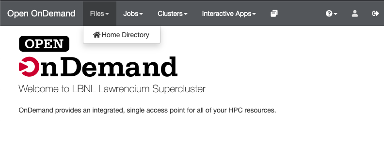
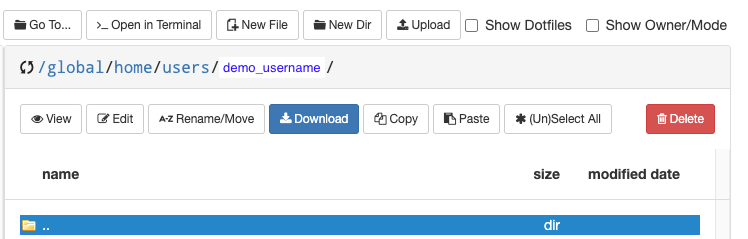
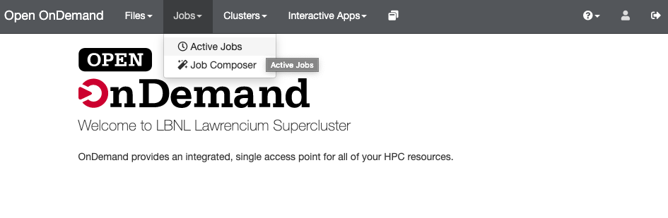
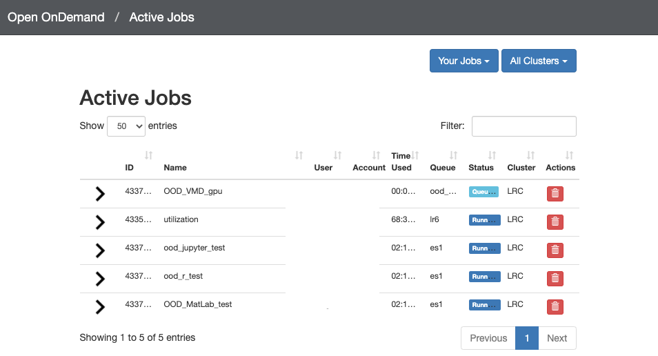
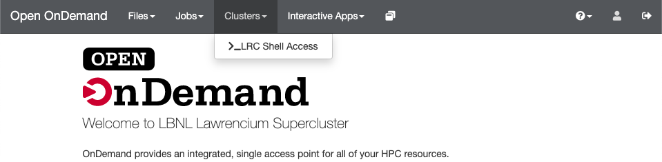
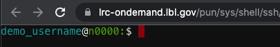

# Open OnDemand Overview

We provide various interactive Apps through the browser-based Open OnDemand service available at [https://lrc-ondemand.lbl.gov](https://lrc-ondemand.lbl.gov){:target="_blank"} {{ ext }}.

The available Apps/services include:

* Jupyter notebooks
* RStudio
* Matlab
* VS Code
* File browsing
* Slurm job listing
* Terminal/shell access (under the "Clusters" tab)

## Logging In

1. Visit [https://lrc-ondemand.lbl.gov](https://lrc-ondemand.lbl.gov){:target="_blank"} {{ ext }} in your web browser.
2. Use your [LRC username](../accounts/user-accounts.md) and [PIN+one-time password(OTP)](../accounts/mfa.md).
    * These are the same credentials you use to login to Lawrencium vis SSH.
    * The username is only your LRC username and should not include the part after the @ sign.
    * Correct username format: `yourusername`
    * Incorrect username format: `yourusername@lbl.gov`

## Service Unit Charges

Open OnDemand apps may launch Slurm jobs on your behalf when requested. Open OnDemand refers to these jobs as *"interactive sessions."* Since these are just Slurm jobs, service units are charged for interactive sessions the same way normal jobs are charged.

!!! note "Interactive_mode, for exploration"

    Interactive sessions running on nodes whose hostnames end in `.ood0` do not cost service units. Sessions can be run on `.ood0` nodes by choosing `interactive_mode, for exploration` under **Type of use** when launching Open OnDemand jobs. Nodes ending in `.ood0` are shared nodes that are provied for low-intensity jobs. These should be treated like login nodes (that is, no intensive computation is allowed).

Job time is counted for interactive sessions as the total time the job runs. The job starts running as soon as a node is allocated for the job. *The interactive session may still be running even if you do not have it open in your web browser.* You can view all currently running interactive sessions under My Interactive Sessions. When you are done, you may stop an interactive session by clicking “Delete” on the session.

There are several ways to monitor usage:

* Since Open OnDemand submits jobs through Slurm, you can [monitor usage as you would monitor your regular Slurm Jobs](../running/monitor-jobs.md).
* View currently running (and recent) sessions launched by Open OnDemand under `My Interactive Sessions`.
* View all currently running jobs under `Jobs > Active Jobs`.

## Using Open OnDemand

Here are some of the services provided via Open OnDemand.

!!! note "Services on Open OnDemand"

    === "Files App"

        Access the Files App from the top menu bar under *Files > Home Directory*. Using the Files App, you can use your web browser to:

        * View files in the Lawrencium filesystem.
        * Create and delete files and directories.
        * Upload and download files from the Lawrencium filesystem to your computer.
        * We recommend using Globus for large file transfers.

        

        

    === "View Active Jobs"

        View and cancel active Slurm jobs from *Jobs > Active Jobs*. This includes jobs started via `sbatch` and `srun` as well as jobs started via Open OnDemand.

        

        

    === "Shell Access"

        Open OnDemand allows Lawrencium shell access from the top menu bar under *Clusters > LRC Shell Access*.

        

        

## Interactive Apps

Additionally, Open OnDemand provides the following interactive apps.

* Desktop App
* Jupyter Server
* MATLAB
* RStudio Server
* VS Code Server

Click on a tab below to learn more about these interactive apps.

!!! note "Interactive Apps on Open OnDemand"

    === "Desktop App"

        The Desktop App allows you to launch an interactive desktop on the Lawrencium cluster. You will be able to launch GUI applications directly on the desktop.

        **Steps:**

        * Select *Desktop* from the *Interactive Apps* menu.
        * Provide the job specifications you want for the Desktop app.
        * Once Desktop is ready, click *Launch Desktop* and the Desktop will open in a new tab.


    === "Jupyter Server"

        See the [Jupyter documentation page](jupyter-server.md) for instructions on using Jupyter notebooks via Open OnDemand. This service replaces the JupyterHub service that we formerly provided.

        **Steps:**
        
        * Select *Jupyter Server* from the *Interactive Apps* menu.
        * Provide the job specifications you want for the Jupyter server.
        * Once Jupyter is ready, click *Connect to Jupyter* to access your Jupyter session.

    === "MATLAB"

        The MATLAB app allows your to use [MATLAB](https://www.mathworks.com/products/matlab.html) GUI on Lawrencium cluster.

        **Steps:**

        * Select *MATLAB* from the *Interactive Apps* menu.
        * Specify the amount of time you would like the MATLAB sessions to run.
        * Once the MATLAB session is ready, click *Launch MATLAB* to access MATLAB GUI.


    === "RStudio Server"

        The RStudio server allows you to use [RStudio](https://www.rstudio.com/) on Lawrencium cluster.

        **Steps:**

        * Select *RStudio Server* from the *Interactive Apps* menu.
        * Provide the job specification you want for the RStudio server.
        * Once RStudio is ready, click *Connect to RStudio* to access RStudio.
        
    === "VS Code Server"

        The VS Code server allows you to use [VS Code](https://code.visualstudio.com/) on Lawrencium cluster.

        **Steps:**

        * Select *VS Code Server* from the *Interactive Apps* menu.
        * Provide the job specification you want for the VS Code server.
        * Once VS Code Server is ready, click *Connect to VS Code* to access VS Code.


!!! warning "Job run time"

    Service units are charged based on job run time. The job may still be running if you close the window or log out. When you are done, shut down an interactive app by clicking *"Delete"* on the session under *My Interactive Sessions*.


## Troubleshooting Open OnDemand

### Common problems

??? info "Problem: Open OnDemand login pop-up box keeps reappearing"

    If you have trouble logging into OOD (including if the login pop-up box keeps reappearing after you enter your username and password), you may need to make sure you have completely exited out of other OOD sessions. This could include closing browser tab(s)/window(s), clearing your browser cache and clearing relevant cookies. You might also try running OOD in an incognito window (or if using Google Chrome, in a new user profile).


### General information for troubleshooting

Logs and scripts for each interactive session with Open OnDemand are stored in:

``` bash
~/ondemand/data/sys/dashboard/batch_connect/sys
```

There are directories for each interactive app type within this directory. For example, to see the scripts and logs for a Jupyter session, you might look at the files under:

``` bash
~/ondemand/data/sys/dashboard/batch_connect/sys/lrc_jupyter/output/da19101d-70b0-43c1-84ff-7d9f0e739419
```